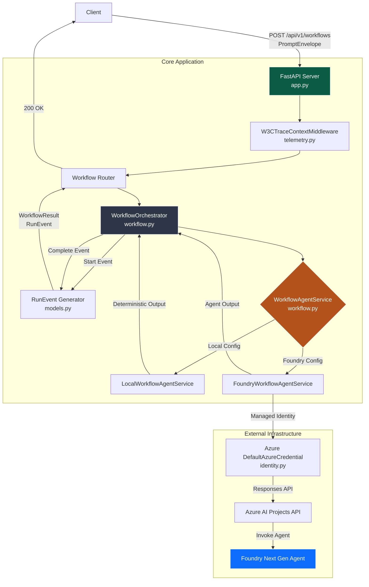

# Architecture

The CAS Reference Product implements a robust boundary for the Coding Autopilot System, designed for deployment within an Azure Container Apps environment. The application uses a strictly typed schema for interactions, adopting canonical `cas-contracts` data structures.

## System Architecture

The following diagram visualizes the primary request flow and components within the application:

## Component Breakdown

1. **FastAPI Web Layer (`app.py`)**:
   - Exposes `/api/v1/workflows` for execution.
   - Provides `/health/live` and `/health/ready` for Kubernetes/Container Apps probes.
   - Manages OpenTelemetry spans, tracking request context via `PromptEnvelope.correlationId`.

2. **Telemetry (`telemetry.py`)**:
   - `W3CTraceContextMiddleware` ensures trace headers (`traceparent`, `tracestate`) are parsed and propagated properly across distributed systems.

3. **Workflow Orchestrator (`workflow.py`)**:
   - Wraps the execution of the agent.
   - Emits canonical `RunEvent` data points (e.g., `workflow.started`, `workflow.completed`, `workflow.failed`).
   - Packages the final execution into a `WorkflowResult`.

4. **Workflow Agent Service (`workflow.py`)**:
   - The application boundary for AI logic.
   - **Local Mode**: Bypasses the cloud entirely. Returns a deterministic output confirming the intake of constraints and intents. Useful for integration testing.
   - **Foundry Mode**: Uses `AIProjectClient` to invoke a designated Foundry Next Gen agent using the Responses API.

5. **Data Models (`models.py`)**:
   - Strongly typed Pydantic models.
   - Requires explicit non-null values, enforcing high-quality data across boundaries (e.g., `PromptEnvelope`, `RunEvent`, `Actor`, `TraceContext`).

6. **Identity (`identity.py`)**:
   - Uses `DefaultAzureCredential` for local development or system-assigned `ManagedIdentityCredential` in Azure.
   - Follows security best practices by strictly avoiding hardcoded secrets or API keys.

## Deployment Strategy

The application is meant to be packaged as a Docker container, running rootless. It's built for the **cas-platform** ecosystem, which dictates the Azure resources, network topology, and Managed Identity mappings externally.
