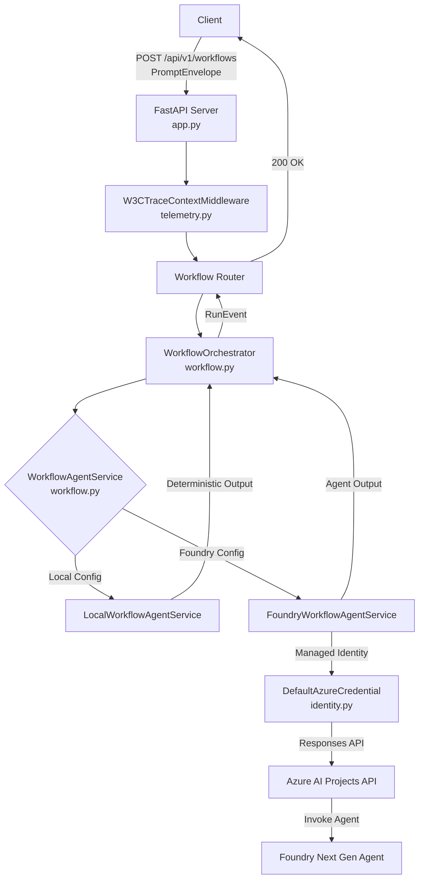

# Architecture

`cas-reference-product` implements a strictly typed request/response boundary using canonical
`cas-contracts` data structures, with interchangeable local and Foundry Next Gen agent adapters
behind the same `WorkflowAgentService` interface.

<!-- codex:generate-image prompt="A single reference workbench with two interchangeable adapter modules plugged into the same socket, one glowing green labeled Local (deterministic, offline), the other labeled Foundry with a dotted cable running to a distant locked cloud icon; isometric, enterprise blue/graphite palette" style="isometric, enterprise, clean" replaces="mermaid-above" -->

## Components

- **FastAPI web layer (`app.py`)** — exposes `/api/v1/workflows`, `/health/live`,
  `/health/ready`; manages OpenTelemetry spans via `PromptEnvelope.correlationId`.
- **Telemetry (`telemetry.py`)** — `W3CTraceContextMiddleware` parses and propagates
  `traceparent`/`tracestate` headers.
- **Workflow Orchestrator (`workflow.py`)** — wraps agent execution, emits canonical `RunEvent`
  data points (`workflow.started`, `workflow.completed`, `workflow.failed`).
- **Workflow Agent Service** — the application boundary for AI logic, with local (deterministic)
  and Foundry Next Gen (managed-identity, Responses API) adapters behind one interface.

## Deployment lock (NO-AZURE posture)

This project does not use Classic Assistants APIs and does not deploy Azure resources. Azure
deployment is locked workspace-wide until a future milestone is deliberately reached — no
service under this workspace may be provisioned or deployed from here. `cas-platform`, the
Container Apps target this repo's interface (`deployment/cas-platform.interface.yaml`) is built
for, is maintained "bicep-ready" (linted, parameterized, pinned per Phase 33) but is not itself
deployed. The Foundry Next Gen adapter in this repo is exercised only through local runs and
CI's Docker health-check smoke test (`ci.yml`'s `docker` job) — never a live Azure deploy.

## Reference-product contract

Deploys as a Linux container image on port `8080` (internal ingress by default), exposing
`/health/live` and `/health/ready`. Workload configuration is non-secret and injected at
runtime; Application Insights connection strings are injected securely from the platform's
observability module outputs.

<!-- docs-verified: 57c21b03a48332728105b72a90e8e89deda409af 2026-07-08 -->
